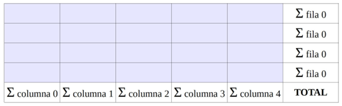

# Ejercicios vectores
## Invertir un Array
Crea un programa que tome un array de números y lo invierta.
Por ejemplo, si tienes el array [1, 2, 3, 4, 5], el programa debería producir [5, 4, 3, 2, 1]

## Suma de elementos
Desarrolla un programa en Java que calcule la suma de todos los elementos presentes en una matriz unidimensional predefinida. El programa debe sumar todos los elementos de la matriz e imprimir el resultado.

## Buscar el Valor Máximo
Desarrolla un programa en Java que identifique y muestre el número más grande presente en una matriz unidimensional 
predefinida. La matriz contiene números enteros y el programa debe encontrar el valor máximo dentro de este vector, 
mostrando el número más grande al final de la ejecución.

## Ordenar Array de Cadenas
Ordena alfabéticamente un array de cadenas.

## Mostrar números pares
Desarrolla un programa en Java que imprima solo los números pares de una matriz unidimensional predefinida.

## Buscar un elemento
Desarrolla un programa en Java que busque un número específico dentro de una matriz unidimensional predefinida. La matriz contiene números enteros y el programa debe buscar un valor dado por el usuario. Si el número buscado se encuentra en la matriz, se imprimirá su posición; de lo contrario, mostrará un mensaje indicando que el número no está presente en la matriz.

# Ejercicios matrices

## Sumar filas/columnas
Escribe un programa que genere al azar 20 números enteros comprendidos entre 0 y 9. Estos números se deben introducir en un array de 4 filas por 5 columnas.
El programa mostrará las sumas parciales de filas y columnas igual que si de una hoja de cálculo se tratara. La suma total debe aparecer en la esquina inferior derecha.

